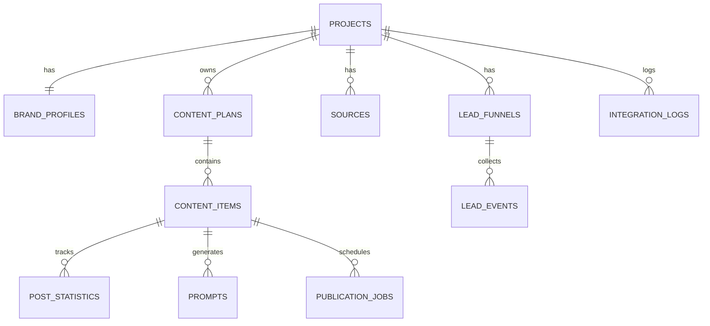
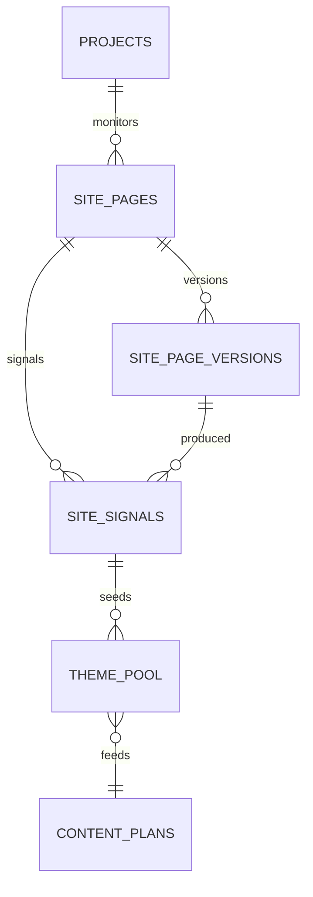

<!--
@file: ER-diagram.md
@description: ER-модель данных Avaterra Telegram SMM Bot для MVP
@dependencies: docs/Project.md, docs/API-spec.md
@created: 2026-05-07
-->

# Avaterra Bot - ER Diagram (MVP)

## 1. Сущности и назначение
- `projects`: карточка проекта и параметры публикации.
- `brand_profiles`: tone of voice, правила бренда, стоп-темы.
- `content_plans`: недельные планы контента.
- `content_items`: посты плана с текстом/визуалом/статусом.
- `sources`: извлеченные данные сайта и материалов.
- `post_statistics`: метрики постов после публикации.
- `prompts`: история промптов и ответов моделей.
- `lead_funnels`: сценарии воронок.
- `lead_events`: события пользователя в воронке.
- `publication_jobs`: очередь публикаций и retry.
- `integration_logs`: наблюдаемость внешних API.

## 2. Диаграмма связей

## 3. Ключевые поля и ограничения

### 3.1 projects
- `id` UUID PK
- `name` text not null
- `niche` text
- `website_url` text not null
- `channel_id` bigint not null
- `timezone` text not null
- `status` text not null default `active`

### 3.2 brand_profiles
- `project_id` UUID PK/FK -> `projects.id`
- `tone_of_voice` text not null
- `style_rules` jsonb
- `prohibited_topics` jsonb
- `target_audience` jsonb
- `goals` jsonb

### 3.3 content_plans
- `id` UUID PK
- `project_id` UUID FK
- `week_start` date not null
- `week_end` date not null
- `status` text not null
- `created_at` timestamptz not null
- unique (`project_id`, `week_start`)

### 3.4 content_items
- `id` UUID PK
- `plan_id` UUID FK
- `publish_date` date not null
- `post_type` text not null check in (`info`, `sales`)
- `topic` text not null
- `objective` text not null
- `outline` text
- `cta` text
- `status` text not null
- `generated_text` text
- `final_text` text
- `image_url` text
- `approved_by` bigint
- `published_at` timestamptz
- `tg_chat_id` bigint (миграция 008, для будущей сверки stats через MTProto)
- `tg_message_id` bigint (миграция 008)
- unique (`plan_id`, `publish_date`, `post_type`)

### 3.5 sources
- `id` UUID PK
- `project_id` UUID FK
- `source_type` text not null
- `url` text
- `title` text
- `content` text
- `extracted_at` timestamptz not null

### 3.6 post_statistics
- `id` UUID PK
- `content_item_id` UUID FK
- `views` int default 0
- `reactions` int default 0
- `ctr` numeric(5,2) default 0
- `comments` int default 0
- `saves` int default 0
- `source` text default `'manual'` (миграция 008, manual / mtproto / bot_api)
- `collected_at` timestamptz not null

### 3.7 prompts
- `id` UUID PK
- `content_item_id` UUID FK
- `prompt_type` text not null
- `prompt_text` text not null
- `model_name` text not null
- `raw_response` text
- `created_at` timestamptz not null

### 3.8 lead_funnels
- `id` UUID PK
- `project_id` UUID FK
- `name` text not null
- `status` text not null
- `slug` text (миграция 008)
- `description` text (миграция 008)
- `created_at` timestamptz default now() (миграция 008)
- unique (`project_id`, `slug`)

### 3.9 lead_events
- `id` UUID PK
- `funnel_id` UUID FK
- `telegram_user_id` bigint not null
- `step` text not null (`start` / `choice` / `freeform`)
- `payload` jsonb
- `segment` text (`info` / `warm` / `hot`, миграция 008)
- `source_item_id` UUID FK content_items (миграция 008)
- `username` text (миграция 008)
- `first_name` text (миграция 008)
- `created_at` timestamptz not null

### 3.10 publication_jobs
- `id` UUID PK
- `content_item_id` UUID FK
- `idempotency_key` text not null unique
- `status` text not null
- `retry_count` int default 0
- `next_retry_at` timestamptz
- `last_error_code` text
- `created_at` timestamptz not null

### 3.11 integration_logs
- `id` UUID PK
- `project_id` UUID FK
- `provider` text not null
- `operation` text not null
- `request_id` text not null
- `status` text not null
- `latency_ms` int
- `error_code` text
- `created_at` timestamptz not null

## 4. Индексы MVP
- `idx_content_items_plan_publish` on (`plan_id`, `publish_date`)
- `idx_content_items_status` on (`status`)
- `idx_post_stats_item_collected` on (`content_item_id`, `collected_at`)
- `idx_prompts_item_type_created` on (`content_item_id`, `prompt_type`, `created_at`)
- `idx_sources_project_extracted` on (`project_id`, `extracted_at`)
- `idx_jobs_status_next_retry` on (`status`, `next_retry_at`)
- `idx_logs_provider_created` on (`provider`, `created_at`)

## 5. Site Radar (новые сущности)

### 5.1 site_pages
Текущее состояние страниц мониторинга.
- `id` UUID PK
- `project_id` UUID FK -> projects
- `url` text not null
- `category` text (`home | course | blog_index | blog_post | faq | about | legal | contact | other`)
- `last_status` int
- `last_etag` text
- `last_modified_at` timestamptz
- `last_seen_at` timestamptz
- `last_content_hash` bytea
- unique (`project_id`, `url`)

### 5.2 site_page_versions
История содержимого страниц.
- `id` UUID PK
- `page_id` UUID FK -> site_pages
- `fetched_at` timestamptz not null
- `http_status` int not null
- `content_hash` bytea not null
- `cleaned_text` text
- `blocks` jsonb not null default '[]'
- `meta` jsonb not null default '{}'
- index (`page_id`, `fetched_at` DESC)

### 5.3 site_signals
Найденные изменения с оценкой значимости.
- `id` UUID PK
- `project_id` UUID FK -> projects
- `page_id` UUID FK -> site_pages
- `version_id` UUID FK -> site_page_versions
- `signal_type` text
- `change_type` text
- `severity` text (`high | medium | low`)
- `score` int not null
- `payload` jsonb not null default '{}'
- `status` text not null default `new` (`new | accepted | rejected | applied`)
- `created_at` timestamptz not null
- `processed_at` timestamptz
- index (`project_id`, `status`, `score` DESC)

### 5.4 theme_pool
Очередь идей для контент-плана.
- `id` UUID PK
- `project_id` UUID FK -> projects
- `topic` text not null
- `angle` text
- `post_type` text (`info | sales`)
- `priority` int not null default 50
- `source_signal_id` UUID FK -> site_signals
- `status` text not null default `pending` (`pending | scheduled | used | dropped`)
- `not_before` date
- `expires_at` date
- `created_at` timestamptz not null

