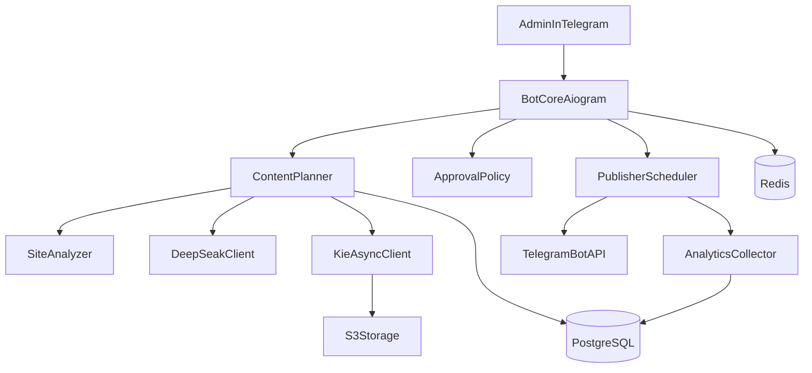

<!--
@file: Project.md
@description: Детальное описание Telegram SMM-бота Avaterra, архитектуры, требований и стандартов
@dependencies: docs/Tasktracker.md, docs/Diary.md, docs/qa.md, docs/Security.md, docs/Session-Handoff-2026-05-22.md, docs/Logging.md, .cursorrules
@created: 2026-05-07
-->

# Avaterra Telegram SMM Bot - Project Documentation

## 1. Назначение и цель

### 1.1 Назначение
Разработать Telegram-бота, который автоматизирует функции SMM и маркетолога для продвижения курсов `avaterra.pro`: анализирует сайт, строит контент-план, генерирует посты и визуалы, публикует по расписанию, собирает аналитику.

### 1.2 Цель системы
Обеспечить стабильный выпуск 7 постов в неделю по типам из knowledge/avaterra.yaml:
- понедельник - educational ("Тело говорит" / "Мышечное тестирование без мистики");
- вторник - pain ("Истории и ситуации");
- среда - practice (короткие практические заметки без раскрытия платных протоколов);
- четверг - author ("Путь ученика", о Татьяне);
- пятница - faq (раздел возражений/вопросов);
- суббота - course (мягкая продажа курсов "Тело не врёт" и "Пробуждение");
- воскресенье - reflection (рефлексия, открытый вопрос подписчикам).

Режим MVP: автопостинг включен по умолчанию, управление через Telegram-меню администратора.

### 1.3 Brand Knowledge Base
Источник истины для бренда - `knowledge/avaterra.yaml`. Файл загружается в `brand_profiles` (JSONB-поля `audiences`, `products`, `author`, `rubrics`, `templates`, `cta_library`, `prohibited_phrases`, `safe_replacements`, `disclaimer`, `quick_links`, `text_whitelist`) автоматически при старте бота и по команде `/kb_load`. Версия фиксируется в `brand_profiles.kb_version` (sha256[:16]). Все 30 тем `theme_bank` зеркалируются в `theme_pool` с `source='kb'` и идемпотентным апдейтом.

## 2. Область MVP

### 2.1 Входит в MVP
- Онбординг проекта (сайт, канал, TOV, ключи интеграций).
- Анализ сайта и материалов бренда.
- Планирование 7-дневного контент-плана.
- Генерация текста через DeepSeak.
- Генерация изображений через KIE (без текста/логотипов/водяных знаков).
- Публикация в Telegram-канал по расписанию.
- Базовая воронка в Telegram по CTA.
- Сбор метрик публикаций (просмотры, реакции, CTR, вовлеченность).

### 2.2 Не входит в MVP
- Полноценная CRM.
- BI-аналитика уровня data warehouse.
- Мультиязычность.
- Генерация видео.
- Медиапланирование по нескольким каналам.
- Полная автоматизация рекламных кабинетов.

## 3. Роли
- **Администратор**: настраивает проект, утверждает правила, смотрит аналитику и ошибки.
- **Редактор/маркетолог**: правит темы и тексты, запускает регенерацию, отмечает стоп-темы.
- **Система**: планирует неделю, генерирует контент, публикует и собирает статистику.

## 4. Пользовательские сценарии (User Story)

### 4.1 Онбординг
Как администратор, я передаю боту параметры проекта, чтобы система могла автоматически готовить контент и публиковать его в нужный канал.

### 4.2 Недельный цикл
Как маркетолог, я хочу получать готовый контент-план и посты на неделю, чтобы быстро контролировать качество и не тратить время на рутину.

### 4.3 Продажа через CTA
Как владелец бизнеса, я хочу вести пользователей из продающего поста в мини-воронку Telegram, чтобы получать сегментированные лиды.

## 5. Функциональные модули

### 5.1 Site Analyzer / Site Radar
- Разовый онбординг сайта: обход ключевых страниц,
  сбор УТП, услуг, FAQ, кейсов, цен, CTA, контактов.
- Непрерывный мониторинг (Site Radar): периодический обход через
  `sitemap.xml` и приоритетные страницы, версионирование,
  семантический дифф и оценка значимости изменений.
- Превращение сигналов в темы постов и обновления контент-плана
  с защитой от дублей (см. `docs/SiteMonitoring.md`).

### 5.2 Content Planner
- Планирует неделю на 3 публикации в фиксированные дни.
- Исключает дубли тем на основе истории.
- Назначает цель поста, тезисы, CTA и требования к визуалу.

### 5.3 Text Generator
- Генерирует текст по шаблонам и целям поста через DeepSeak API.
- Поддерживает стили: экспертный, информационный, продающий, прогревающий.
- Проверяет длину, структуру, читабельность, уникальность формулировок.

### 5.4 Image Generator
- Формирует промпты с жесткими ограничениями "без текста".
- Работает с KIE API в асинхронном режиме (submit -> task_id -> polling/callback).
- Сохраняет медиа в S3-совместимое хранилище.

### 5.5 Publication Module
- Публикует контент по расписанию (по умолчанию 11:00 МСК) в одном из режимов:
  - **`channel`** (боевой): фото + текст в `TARGET_CHANNEL_ID`, статус `published`.
  - **`admin_preview`** (временный): только текст в личку `admin_preview_recipient_ids` (`ADMIN_TELEGRAM_IDS` минус `ADMIN_PREVIEW_EXCLUDE_IDS`), статус `admin_preview_sent`.
- Переключение режима: `PUBLISH_MODE=channel|admin_preview` в `.env` (без правок кода).
- `IMAGE_GENERATION_ENABLED=false` отключает KIE на всём пайплайне.
- Идемпотентность предпросмотра: не повторять `admin_preview_sent`, слать только `publish_date = сегодня`.
- Подробный handoff: `docs/Session-Handoff-2026-05-22.md`.
- Поддерживает отложенные задачи и защиту от дублей.
- Уведомляет администратора об ошибках.

### 5.6 Funnel Module
- Добавляет CTA в продающий пост.
- Запускает диалог квалификации.
- Сегментирует лидов и отправляет горячие заявки администратору/в CRM webhook.

### 5.7 Analytics Module
- Сбор просмотров, реакций, CTR, вовлеченности.
- Отчеты по лучшим темам недели.
- Сравнение эффективности информационных и продающих постов.

## 6. Бизнес-логика публикаций

### 6.1 Ритм
- Пн: информационный пост (доверие/охват).
- Ср: информационный пост (доверие/охват).
- Пт: продающий пост (конверсия).

Правило: один пост = одна цель.

### 6.2 Логика недельного цикла
1. Анализ сайта и прошлой статистики.
2. Выбор 3 тем недели.
3. Генерация контент-плана.
4. Генерация текста и изображений.
5. Quality check.
6. Публикация.
7. Сбор аналитики и обновление базы знаний.

### 6.3 Шаблон продающего поста
Проблема -> усиление -> решение -> выгоды -> социальное доказательство -> оффер -> CTA -> ограничение по времени.

## 7. Архитектура

### 7.1 Высокоуровневая схема

### 7.2 Компоненты и ответственность
- **Bot Core (aiogram)**: команды, меню, ACL, orchestration.
- **Planner Service**: многоходовой weekly pipeline, ретраи (`quality_failed` → полный `prepare_item`, `text_ready` → `complete_image_for_item`), сверка плана 7/7, уведомления админам по итогам.
- **Generator Services**: текст и изображение с retry/fallback.
- **Scheduler Worker**: публикация, ретраи, идемпотентность.
- **Analytics Worker**: сбор и расчет KPI.
- **Storage Layer**: PostgreSQL + Redis + S3.

### 7.2.1 Автономный недельный пайплайн (Sprint 6)
- Cron `Sun 19:00 MSK` → `_planner_job` → `run_weekly_pipeline(target_monday=upcoming_week_monday(today))`.
- `WEEKLY_PIPELINE_EXTRA_PASSES` задаёт количество доп. проходов; на каждом из них перечитывается актуальный список постов из БД.
- Pass 1: `draft` / `failed` / `dedup_blocked` / `quality_failed`. Доп. проходы: те же плюс `text_ready` (картинка). Если `prepare_item` падает исключением — item → `failed` с `last_error`, чтобы следующий проход его подхватил (не оставляем «немой» `draft`).
- После каждой LLM-попытки `text_generator` вызывает `salvage_text`: детерминированно чинит лексику, CTA, дисклеймер, неизвестные URL и `too_long`. Оставшиеся коды пишутся в `last_error` как `quality:<codes>`.
- После всех проходов идёт сверка: non-ready items попадают в `problem_items`; `admin_preview_sent` считается готовым; синтетический `missing` — только если на календарный день нет ни одного item. Список приходит админам.
- Уведомления админам формирует `services/planner/weekly_notify.py`. На любой исход (успех/частично/сбой) к сообщению крепится клавиатура с кнопками «Очередь качества», «План недели», «Перезапустить генерацию».
- Та же кнопка «Подготовить след. неделю» доступна вручную в `/admin` (callback `adm:genweek`) и работает с защитой от двойного запуска через `asyncio.Lock`.

### 7.3 Режимы запуска
- Production: webhook.
- Dev/Staging: long polling.
- Отдельный worker для фоновых задач.
- Отдельный scheduler для недельного планирования.

## 8. Технический стек
- Python 3.12+
- aiogram
- PostgreSQL
- Redis
- APScheduler или Celery
- HTTP client для Telegram/DeepSeak/KIE
- Docker + Nginx
- S3 storage

## 9. Нефункциональные требования

### 9.1 Безопасность
- Секреты только в env/secret storage.
- Не логировать секреты и персональные данные.
- Webhook secret token + allowlist админов.
- Валидация входных данных на каждом интеграционном входе.

### 9.2 Производительность
- Подготовка недельного плана <= 10 минут при штатной нагрузке.
- Публикация по расписанию с отклонением не более 2 минут.
- Повторные запросы к внешним API через backoff и circuit breaker.

### 9.3 Надежность
- Идемпотентность публикации.
- Защита от повторной постановки задачи.
- Наблюдаемость: structured logs + health checks + алерты.

## 10. Стандарты качества контента

### 10.1 Тексты
- Без воды, с логикой и структурой.
- Соответствие теме и TOV.
- Наличие CTA там, где это требуется.
- Без повторов формулировок и шаблонов.

### 10.2 Изображения
- Без текста, букв, цифр, логотипов, баннеров и водяных знаков.
- Соответствие теме поста и формату Telegram.
- Без видимых артефактов.

## 11. Acceptance Criteria (MVP)
- Бот принимает и сохраняет параметры проекта.
- Выполняется анализ сайта и формируется карточка проекта.
- Создается недельный контент-план с 3 публикациями по графику Пн/Ср/Пт.
- Генерируются посты и изображения по каждой теме.
- Посты публикуются в целевой канал без дублей.
- Запускается базовая воронка по CTA.
- Сохраняется и отображается статистика публикаций.

## 12. Поддерживаемость и консистентность
- При изменении архитектуры, модулей, SLA или интеграций обновлять этот файл.
- Все решения по безопасности фиксировать в `docs/Security.md`.
- Все изменения этапов и статусов фиксировать в `docs/Tasktracker.md`.
- Ключевые решения и проблемы фиксировать в `docs/Diary.md`.

## 13. Эксплуатация и сопутствующая документация
- Бэкапы и обновления: `docs/Deployment.md` (ротация ≤7 дней).
- Логирование и анализ ошибок: `docs/Logging.md` (ротация ≤14 дней).
- Антидубли контента: `docs/Deduplication.md` (MinHash + ключевые слова + SHA-256).
- Мониторинг сайта (Site Radar): `docs/SiteMonitoring.md`.
- Все скрипты эксплуатации - в каталоге `deploy/` (deploy/backup/restore/install).

## 14. Администрирование (Telegram-only)

Веб-админки нет. Все операции админа выполняются в Telegram через `bot/handlers/admin.py` с защитой `AdminOnlyMiddleware` (фильтр по `ADMIN_TELEGRAM_IDS`). Middleware применяется и к сообщениям, и к callback-запросам.

### 14.1 Точка входа
- `/admin` - главное inline-меню: «План недели», «Очередь качества», «Радар», «Статус», тумблеры авто-публикации и dry_run.
- `/admin_help` - текстовая справка по всем командам (для опытных админов).

### 14.2 Поток «План недели»
1. Команда `/plan` или кнопка «План недели» возвращает текущий план недели без триггера повторной сборки (`get_current_week_plan`).
2. По каждому посту видны день, тип, статус, тема и `id`.
3. Превью отдельного поста: `/preview <id>` (текст + картинка).

### 14.3 Поток «Очередь качества»
1. Кнопка «Очередь качества» или `/quality_queue` показывает посты в статусе `quality_failed` (репозиторий `list_items_by_status`).
2. Для каждого поста выводятся коды последней неудачной проверки (`latest_quality_codes`).
3. Действия inline-кнопок: «↻ Перегенерировать», «text» (полный текст), «skip» (помечает `failed`).
4. Регенерация (`adm:qg:rg`) сбрасывает item через `reset_item_for_regeneration`, заново вызывает `prepare_item` и сообщает админу новый статус. Команда `/regenerate <id>` делает то же самое из CLI.

### 14.4 Поток «Site Radar»
- `/radar` - расписание APScheduler.
- `/radar_now` - принудительный полный обход; ответ включает `noise_share`, число `signals_high/medium/low` и количество отброшенных дубликатов.
- `/radar_signals [high|medium|all] [page]` или кнопка «Радар» в меню - аудит сигналов с фильтром по severity и пагинацией. Каждая запись содержит `severity/score`, тип сигнала, URL, summary и текущий `status` (`new`, `applied`, `rejected`).

### 14.5 Подключение theme_pool ↔ Site Radar
- Сигналы радара со score ≥ 30 превращаются в `theme_pool` через `strategist.build_theme` с `source='radar'`, `audience` и `rubric` из 7 типов AVATERRA. Дубли с уже существующими темами (включая `source='kb'`) фильтруются через `is_duplicate_topic` за 90 дней.
- Метрики каждого цикла Site Radar сохраняются в `integration_logs` (`provider='site_radar'`) и доступны для долгосрочной аналитики и SLA по noise.

### 14.6 Контроли
- Toggle «Авто-публ.» и «dry_run» в главном меню переключают `enable_auto_publish` и `dry_run` in-memory (без рестарта).
- Все callback'и проходят через тот же `AdminOnlyMiddleware`, так что чужие нажатия отбрасываются с alert «Доступ ограничен».

