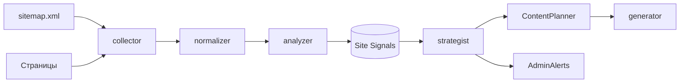

<!--
@file: SiteMonitoring.md
@description: Архитектура и правила работы Site Radar - модуля непрерывного мониторинга avaterra.pro
@dependencies: docs/Project.md, docs/Deduplication.md, docs/ER-diagram.md, docs/API-spec.md
@created: 2026-05-07
-->

# Avaterra Site Radar - архитектура мониторинга сайта

## 1. Цель
Сделать сайт `avaterra.pro` источником живых сигналов для контент-стратегии:
видеть новые услуги, цены, кейсы, FAQ и статьи; фильтровать шум;
превращать значимые изменения в темы постов и обновления контент-плана.

## 2. Область мониторинга

### 2.1 Уровни сущностей
- Страницы (URL).
- Контентные блоки (`<section>`, `<article>`, semantic-обертки Next.js).
- Текстовые элементы (заголовки, цены, CTA, FAQ-вопросы).
- Структурные сигналы (новые URL в `sitemap.xml`, изменение `<meta>`).

### 2.2 Карта объектов (на старте)
Источник: `https://avaterra.pro/sitemap.xml` (16 URL).
- Главная: `/`.
- Курсы: `/course/<slug>` (2 курса).
- Контент: `/blog`, `/blog/<slug>` (6 статей), `/faq`, `/about`.
- Юридические: `/oferta`, `/privacy`, `/pd-consent`, `/contacts`.

Категория страницы определяется по URL:
- `home`, `course`, `blog_index`, `blog_post`, `faq`, `about`, `legal`, `contact`.

### 2.3 Что считаем значимым
- Новый URL в `sitemap.xml`.
- Новый блок услуги или курса.
- Изменение цены, тарифа, оффера или CTA.
- Новый кейс, отзыв, лид-магнит.
- Новые FAQ-вопросы.
- Удаление существующих услуг или статей.
- Сильное изменение позиционирования (заголовок H1 главной, мета-теги).

### 2.4 Что не считаем значимым
- Даты, счетчики, таймеры акций.
- Перестановка декоративных блоков.
- Изменения футера и навигации.
- Изменения хешей в `_next/static/`.
- Косметика: пробелы, регистр, эмодзи в одиночных позициях.

## 3. Архитектурные слои
1. **Сбор (Collector)**: загрузка `sitemap.xml`, `robots.txt`, страниц.
2. **Очистка (Normalizer)**: удаление шума, выделение значимых блоков.
3. **Анализ (Analyzer)**: дифф, классификация изменений, оценка значимости.
4. **Стратегия (Strategist)**: превращение сигналов в темы и правки контент-плана.
5. **Генерация и публикация (Generator)**: интеграция с DeepSeek/KIE/Publisher.

## 4. Алгоритм работы

### 4.1 Сбор
- Расписание: основной обход каждые 6 часов; ускоренный для `/`, `/course/*`, `/blog` каждый час.
- Уважение `robots.txt` и rate limit (1 запрос/сек, не больше 5 параллельных).
- HTTP-клиент `aiohttp` с timeout 15s; повтор 3 попытки с backoff.
- При смене ETag/Last-Modified либо при изменении content-hash страницы создается новая версия.

### 4.2 Нормализация
- Парсинг через `BeautifulSoup` + `lxml`.
- Удаление узлов: `<header>`, `<nav>`, `<footer>`, `<script>`, `<style>`,
  блоки с классами `cookie`, `banner`, `notification`, `toast`, `popup`.
- Удаление шумных селекторов из `noise_selectors` (конфигурируется).
- Удаление дат, счетчиков (`\d{2}:\d{2}:\d{2}`, `\d+ дн`, акционные таймеры).
- Извлечение блоков:
  - `title`, `meta description`;
  - `<h1>`, `<h2>`, `<h3>`;
  - `<section>` или `<article>` со значимым текстом;
  - FAQ-блоки (по эвристике "вопрос + ответ");
  - блоки цен (наличие валюты `₽` или `руб`).
- Сериализация: список блоков `(block_type, key, normalized_text, hash)`.

### 4.3 Сравнение и классификация
- Сравнение по двум осям:
  - на уровне блоков (через `block_key + sha256(normalized_text)`);
  - на уровне ключевых слов (наш `extract_keywords` + Жаккард).
- Классификатор присваивает тип события `change_type`:
  - `new_url`, `removed_url`, `new_block`, `updated_block`,
    `removed_block`, `price_changed`, `cta_changed`,
    `meta_changed`, `noise`.
- Шумовые изменения (`noise`) сразу отбрасываются.

### 4.4 Оценка значимости
- Базовый рейтинг от 0 до 100.
- Веса (пример):
  - `new_url` страницы курса: +40.
  - `new_url` статьи блога: +20.
  - `price_changed`: +35.
  - `cta_changed`: +25.
  - `new_block` на курсе или главной: +25.
  - `updated_block` с keyword shift > 0.4: +15.
  - `meta_changed` H1/title: +10.
  - `noise`: 0 (отфильтровано).
- Пороги:
  - `>= 60` - **высокая** значимость, срочный сигнал, уведомление админу.
  - `30..59` - **средняя**, попадает в очередь идей контента.
  - `< 30` - **низкая**, только в журнал, без действий.

### 4.5 Стратегия адаптации контента
Каждому сигналу подбираем тип поста по правилам:
- Новая услуга/курс -> продающий пост + прогревающий пост.
- Новая цена -> продающий пост (выгода, ограничение).
- Новый кейс -> пост-доказательство (info).
- Новый FAQ -> мини-серия экспертных постов.
- Новый блог-пост -> анонс + дайджест.
- Изменение CTA/оффера -> переработка ближайшего sales-поста в плане.

Каждое предложение темы перед добавлением в план проходит:
1. Проверку соответствия позиционированию (`brand_profiles.target_audience` + `goals`).
2. Проверку через `DuplicateChecker` против `content_fingerprints` за 90 дней.
3. Если тема уже была - выбирается другой ракурс (`angle`) либо сигнал
   откладывается на N дней.

### 4.6 Допуск в контент-план
- Сильные сигналы (>=60) могут вытеснить запланированные темы недели,
  если их статус еще `draft` и нет `published_at`.
- Средние сигналы попадают в `theme_pool` и используются по приоритету.
- Низкие - не попадают, остаются как `signal_log`.

## 5. Хранение данных (новые сущности)

### 5.1 site_pages
Текущее состояние страниц.
- `id`, `project_id`, `url`, `category`, `last_status`, `last_etag`,
  `last_modified_at`, `last_seen_at`, `last_content_hash`.
- Уникальный ключ: `(project_id, url)`.

### 5.2 site_page_versions
История версий страниц.
- `id`, `page_id`, `fetched_at`, `http_status`, `content_hash`,
  `cleaned_text`, `blocks` (JSONB), `meta` (JSONB).
- Индекс: `(page_id, fetched_at DESC)`.

### 5.3 site_signals
Сигналы изменений с оценкой значимости.
- `id`, `page_id`, `version_id`, `signal_type`, `change_type`,
  `severity`, `score`, `payload` (JSONB), `status`
  (`new`, `accepted`, `rejected`, `applied`),
  `created_at`, `processed_at`.
- Индекс: `(project_id, status, score DESC)`.

### 5.4 theme_pool
Очередь идей контента.
- `id`, `project_id`, `topic`, `angle`, `post_type`,
  `priority`, `source_signal_id`, `status`,
  `not_before`, `expires_at`, `created_at`.

## 6. Безопасность и устойчивость
- Соблюдение `robots.txt`, лимиты RPS, экспоненциальный backoff на 429/503.
- User-Agent: `AvaterraSiteRadar/1.0 (+https://avaterra.pro)`.
- Кеширование `ETag/Last-Modified` для экономии трафика.
- Все ответы и решения логируются в `integration_logs` с `provider=site`.
- Любая ошибка парсера переводит сигнал в статус `rejected` и не блокирует pipeline.

## 7. Метрики качества
- Доля шумовых сигналов после фильтрации (цель: < 5%).
- Доля сигналов высокой значимости, превратившихся в опубликованные посты.
- Среднее время от обнаружения до публикации.
- Частота "ложных дублей" (отклонены DuplicateChecker, хотя были разные углы).

## 8. Что входит в MVP Site Radar
1. Сбор по `sitemap.xml` + категоризация URL.
2. Загрузка и нормализация контента, версионирование страниц.
3. Дифф по блокам и keyword shift.
4. Классификация изменений и оценка значимости.
5. Запись сигналов в `site_signals`, наполнение `theme_pool`.
6. Уведомление админа о сигналах высокой значимости в Telegram.

## 9. Что вне MVP
- Headless-браузер (Playwright) - нужен только если появится JS-only контент.
- Embedding-ы для тонкой семантики (включить, если ложные срабатывания будут высокими).
- Автокластеризация рубрик и A/B ракурсов постов.
- Сигналы от внешних RSS-источников.
