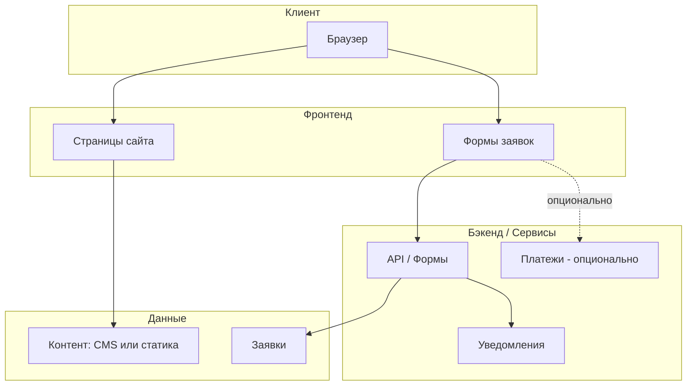

# ALETHEIA — описание проекта

**Проект:** Веб-сайт школы ALETHEIA (Школа подсознания и мышечного тестирования)  
**Прототип:** https://aletheia--6eat7ck.gamma.site/  
**Версия документа:** 2.0  
**Дата:** 2025-02-14

---

## 1. Цели проекта

| Цель | Описание |
|------|----------|
| **Основная** | Продажа курсов школы через сайт |
| **Информационная** | Предоставление информации о школе и услугах |
| **Конверсия** | Вовлечение посетителей и перевод в заявки/оплату курсов |

---

## 2. Функциональные требования

### 2.1 Структура сайта (концепция 2.0)

Ориентация на конверсию и современные тренды: основательница в центре, короткие блоки, один явный CTA.

| Секция | Содержание |
|--------|------------|
| **Hero** | Фото основательницы Татьяны Стрельцовой + название школы + ценность + один CTA «Записаться на консультацию» |
| **Почему ALETHEIA** | 4 карточки ценностей + цифры (20 лет, 15 000+ человек) |
| **Форматы работы** | 4 карточки: консультация (5 000 ₽), групповой тренинг (3 000 ₽/чел.), курс ALETHEIA 10 занятий (25 000 ₽), онлайн (3 500 ₽). Курс выделен как «Популярный». |
| **О мастере** | Второе фото Татьяны + краткая история от первого лица + CTA |
| **Отзывы** | 3 отзыва (сжатые формулировки) |
| **Записаться** | Контакты (имя, телефон, email, адрес) + форма заявки. Партнёры — одной строкой. |
| **Футер** | Логотип, слоган, кнопка «Записаться», копирайт |

Изображения: реальные фото Татьяны Стрельцовой в `public/images/tatiana/`; фоны hero и секции — сгенерированные в светлой кремовой палитре (hero-cream.jpg, section-cream.jpg). См. `docs/Content.md` и `docs/Media.md`.

### 2.2 Продажа курсов
- Карточки курсов с ясным CTA (записаться, купить, оставить заявку)
- Форма заявки и/или интеграция с платёжной системой
- Обработка заявок (уведомления, хранение)

### 2.3 Нефункциональные требования
- **Безопасность:** защита форм, HTTPS, соответствие практике работы с персональными данными
- **Производительность:** быстрая загрузка, оптимизация изображений и ресурсов
- **Поддерживаемость:** понятная структура, документация, единый стиль кода
- **Консистентность:** единый тон, визуальный стиль, структура страниц

---

## 3. Архитектура

### 3.1 Общая схема



### 3.2 Варианты технической реализации

| Вариант | Описание | Плюсы | Минусы |
|---------|----------|--------|--------|
| **A. Статический сайт + формы** | HTML/CSS/JS или SSG (e.g. Next.js, Astro), формы через внешний сервис (Formspree, Tilda и т.п.) | Простота, дешевый хостинг, безопасность | Ограниченная кастомизация сбора данных |
| **B. SSG + headless CMS** | Контент в CMS (Strapi, Sanity, etc.), сборка статики | Удобное редактирование контента без программиста | Сложнее и дороже в поддержке |
| **C. Full-stack приложение** | Фронт + свой бэкенд (Node, Python и т.д.) | Полный контроль, свои платежи, логика | Выше затраты на разработку и хостинг |

*Конкретный выбор зафиксировать после ответов на вопросы в `qa.md`.*

### 3.3 Структура проекта (текущая)

**Стек:** Vite + HTML + CSS + JS (одностраничный лендинг).

```
ALETHEIA/
├── docs/                 # Документация
│   ├── Project.md
│   ├── Content.md
│   ├── Media.md
│   ├── Tasktracker.md
│   ├── Diary.md
│   └── qa.md
├── src/
│   ├── style.css         # Стили лендинга
│   └── main.js          # Меню, форма, поведение
├── public/
│   └── images/           # Медиа (см. docs/Media.md)
│       ├── tatiana/      # Фото Татьяны с прототипа
│       ├── partners/
│       └── sections/
├── index.html            # Разметка всех секций
├── package.json
├── vite.config.js
├── .cursorrules
├── .gitignore
└── README.md
```

---

## 4. Этапы разработки

| Этап | Содержание | Результат |
|------|------------|-----------|
| **1. Уточнение и дизайн** | Ответы на qa.md, согласование контента и прототипа | ТЗ, макеты/референсы |
| **2. Базовая вёрстка** | Главная, о школе, услуги, курсы (без бэкенда) | Статичные страницы |
| **3. Формы и заявки** | Формы обратной связи и записи на курсы, приём заявок | Работающие формы |
| **4. Интеграции** | Платежи, почта/уведомления (по решению) | Полный цикл заявки/оплаты |
| **5. Контент и SEO** | Тексты, мета-теги, производительность | Готовый к запуску сайт |
| **6. Запуск и поддержка** | Деплой, мониторинг, правки | Продакшен и сопровождение |

---

## 5. Технологии и стандарты

### 5.1 Текущий стек
- **Фронтенд:** HTML5, CSS3, JavaScript (vanilla)
- **Стили:** один файл src/style.css, BEM-подобные классы, CSS-переменные
- **Сборка:** Vite (dev-сервер и production build)
- **Формы:** разметка готова; отправка — TODO (Formspree или свой endpoint)
- **Хостинг:** статический (dist/ после `npm run build`)

### 5.2 Стандарты кода и процесса
- **Консистентность:** единый стиль именования (файлы, классы, переменные)
- **Доступность:** базовая a11y (семантика, контраст, фокус)
- **Безопасность:** валидация и санитизация ввода, HTTPS, не хранить чувствительные данные в клиенте
- **Документирование:** обновление Project.md при изменении архитектуры или функциональных требований

### 5.3 Поддерживаемость
- Чёткое разделение: разметка / стили / логика
- Переиспользуемые компоненты/блоки
- Документация решений в Diary.md

---

## 6. Связанные документы

| Документ | Назначение |
|----------|------------|
| `docs/Project.md` | Этот файл — цели, архитектура, этапы, технологии |
| `docs/Content.md` | Все тексты с прототипа для вёрстки и наполнения |
| `docs/Media.md` | Изображения: Татьяна с прототипа, остальные — в едином стиле |
| `docs/Tasktracker.md` | Отслеживание задач и приоритетов |
| `docs/Diary.md` | Дневник решений, наблюдений и проблем |
| `docs/qa.md` | Вопросы по архитектуре и требованиям |

---

*При внесении изменений в архитектуру или добавлении новых функциональных требований — обновлять данный файл и при необходимости Tasktracker.md и Diary.md.*
