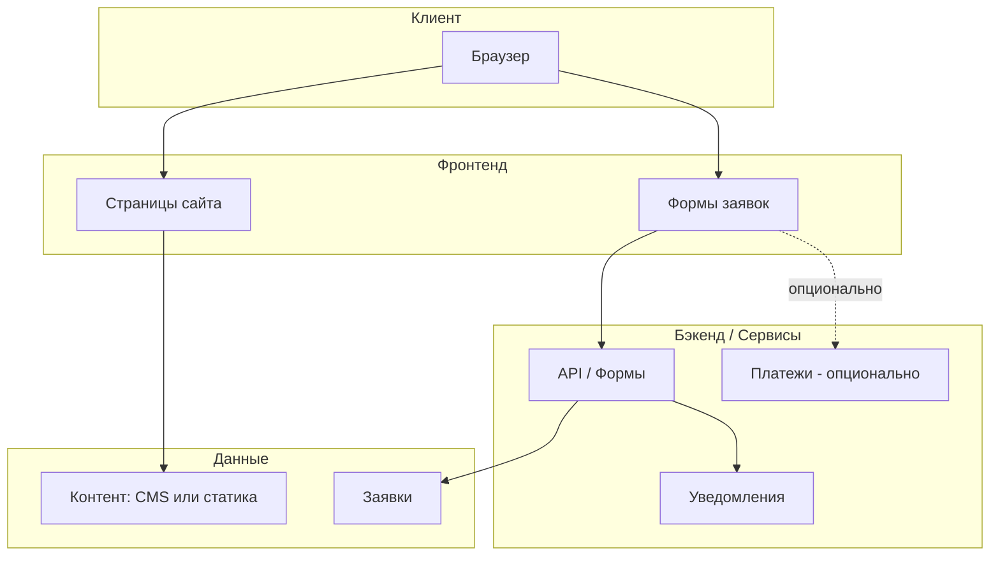

# AVATERRA — описание проекта

**Проект:** Веб-сайт школы AVATERRA (Phygital школа мышечного тестирования, курс «Тело не врет»)  
**Домен:** https://avaterra.pro  
**Версия документа:** 3.0  
**Дата:** 2025-03-09

---

## 1. Цели проекта

| Цель | Описание |
|------|----------|
| **Основная** | Продажа курсов школы через сайт |
| **Информационная** | Предоставление информации о школе и услугах |
| **Конверсия** | Вовлечение посетителей и перевод в заявки/оплату курсов |

---

## 2. Функциональные требования

### 2.1 Структура сайта (концепция 2.0)

Ориентация на конверсию и современные тренды: основательница в центре, короткие блоки, один явный CTA.

| Секция | Содержание |
|--------|------------|
| **Hero** | Фото основательницы Татьяны Стрельцовой + название школы + ценность + один CTA «Записаться на консультацию» |
| **Почему AVATERRA** | 4 карточки ценностей + цифры (20 лет, 15 000+ человек) |
| **Форматы работы** | 4 карточки: консультация (5 000 ₽), групповой тренинг (3 000 ₽/чел.), курс AVATERRA 10 занятий (25 000 ₽), онлайн (3 500 ₽). Курс выделен как «Популярный». |
| **О мастере** | Второе фото Татьяны + краткая история от первого лица + CTA |
| **Отзывы** | 3 отзыва (сжатые формулировки) |
| **Записаться** | Контакты (имя, телефон, email, адрес) + форма заявки. Партнёры — одной строкой. |
| **Футер** | Логотип, слоган, кнопка «Записаться», копирайт |

Изображения: реальные фото Татьяны Стрельцовой в `public/images/tatiana/`; фоны hero и секции — сгенерированные в светлой кремовой палитре (hero-cream.jpg, section-cream.jpg). См. `docs/Content.md` и `docs/Media.md`.

### 2.2 Продажа курсов
- Карточки курсов с ясным CTA (записаться, купить, оставить заявку)
- Форма заявки и/или интеграция с платёжной системой
- Обработка заявок (уведомления, хранение)

### 2.3 Нефункциональные требования
- **Безопасность:** защита форм, HTTPS, соответствие практике работы с персональными данными
- **Производительность:** быстрая загрузка, оптимизация изображений и ресурсов
- **Поддерживаемость:** понятная структура, документация, единый стиль кода
- **Консистентность:** единый тон, визуальный стиль, структура страниц

---

## 3. Архитектура

### 3.1 Общая схема


```mermaid
graph TB
    subgraph "Клиент"
        Browser[Браузер]
    end
    subgraph "Фронтенд"
        Pages[Страницы сайта]
        Forms[Формы заявок]
    end
    subgraph "Бэкенд / Сервисы"
        API[API / Формы]
        Payments[Платежи - опционально]
        Notify[Уведомления]
    end
    subgraph "Данные"
        CMS_or_Static[Контент: CMS или статика]
        Leads[Заявки]
    end
    Browser --> Pages
    Browser --> Forms
    Forms --> API
    API --> Leads
    API --> Notify
    Forms -.->|опционально| Payments
    Pages --> CMS_or_Static
```

### 3.2 Варианты технической реализации

| Вариант | Описание | Плюсы | Минусы |
|---------|----------|--------|--------|
| **A. Статический сайт + формы** | HTML/CSS/JS или SSG (e.g. Next.js, Astro), формы через внешний сервис (Formspree, Tilda и т.п.) | Простота, дешевый хостинг, безопасность | Ограниченная кастомизация сбора данных |
| **B. SSG + headless CMS** | Контент в CMS (Strapi, Sanity, etc.), сборка статики | Удобное редактирование контента без программиста | Сложнее и дороже в поддержке |
| **C. Full-stack приложение** | Фронт + свой бэкенд (Node, Python и т.д.) | Полный контроль, свои платежи, логика | Выше затраты на разработку и хостинг |

*Конкретный выбор зафиксировать после ответов на вопросы в `qa.md`.*

### 3.3 Структура проекта (текущая, v3.0)

**Стек:** Next.js 14 (App Router), TypeScript, Tailwind CSS, Framer Motion, React Three Fiber, PayKeeper, Supabase (Auth, DB, Storage), Resend, Telegram Bot API. Версионирование: SemVer, CHANGELOG.md.

**Роли:** user (студент), manager (поддержка), admin. RBAC в middleware для `/portal/*`.

```
ALETHEIA/
├── app/
│   ├── layout.tsx, page.tsx, globals.css
│   ├── (auth)/login, register, reset-password
│   ├── success/, oferta/, privacy/
│   ├── portal/                    # Портал (требует авторизации)
│   │   ├── layout.tsx             # Shell + PortalHeader
│   │   ├── student/               # ЛК студента
│   │   │   ├── dashboard, courses, certificates, media, notifications, profile
│   │   │   └── courses/[id]/play  # SCORM-плеер
│   │   ├── admin/                 # Консоль администратора
│   │   │   └── dashboard, users, courses, certificates, media, payments, crm,
│   │   │       communications, ai-settings, audit, settings
│   │   └── manager/               # Кабинет менеджера
│   │       └── dashboard, tickets, users, verifications
│   └── api/
│       ├── payment/create, webhook/paykeeper, contact, chat
│       └── portal/                # scorm/progress, scorm/url, certificates/[id]/download
│           ├── admin/courses/upload
│           └── telegram/webhook
├── components/
│   ├── sections/   # Hero, About, Program, Author, Testimonials, Pricing, FAQ, Contact, Header, Footer
│   ├── portal/     # PortalHeader, PortalSidebar, UsersTable
│   ├── ui/, 3d/, PaymentModal.tsx, ChatBot.tsx
├── lib/
│   ├── utils.ts, paykeeper.ts, auth.ts, audit.ts, email.ts, telegram.ts
│   ├── certificates.tsx           # PDF сертификаты (@react-pdf/renderer)
│   └── supabase/client.ts, server.ts, request.ts
├── supabase/migrations/           # 001_portal_schema, 002_rls_policies, 003_profiles_email
├── middleware.ts                  # RBAC для /portal/*
├── CHANGELOG.md
├── docs/, .cursorrules, .env.example
└── README.md
```

---

## 4. Этапы разработки

| Этап | Содержание | Результат |
|------|------------|-----------|
| **1. Уточнение и дизайн** | Ответы на qa.md, согласование контента и прототипа | ТЗ, макеты/референсы |
| **2. Базовая вёрстка** | Главная, о школе, услуги, курсы (без бэкенда) | Статичные страницы |
| **3. Формы и заявки** | Формы обратной связи и записи на курсы, приём заявок | Работающие формы |
| **4. Интеграции** | Платежи, почта/уведомления (по решению) | Полный цикл заявки/оплаты |
| **5. Контент и SEO** | Тексты, мета-теги, производительность | Готовый к запуску сайт |
| **6. Запуск и поддержка** | Деплой, мониторинг, правки | Продакшен и сопровождение |

---

## 5. Технологии и стандарты

### 5.1 Текущий стек
- **Фреймворк:** Next.js 14 (App Router), TypeScript
- **Стили:** Tailwind CSS (палитра: primary #2D1B4E, secondary #D4AF37, dark #0A0E27), шрифты Literata + Outfit
- **Анимации:** Framer Motion, React Three Fiber (Hero)
- **Платежи:** PayKeeper API (lib/paykeeper.ts)
- **Данные:** Supabase (Auth, PostgreSQL, Storage). Таблицы: profiles, courses, enrollments, scorm_progress, certificates, media, notifications, tickets, audit_log, comms_templates, llm_settings, orders, leads.
- **Портал:** Роли user/manager/admin, middleware RBAC, SCORM-плеер (iframe + API progress), сертификаты (PDF через @react-pdf/renderer), Resend для email, Telegram webhook для бота.
- **Деплой:** Vercel или VPS (см. docs/Deploy.md)

### 5.2 Стандарты кода и процесса
- **Консистентность:** единый стиль именования (файлы, классы, переменные)
- **Доступность:** базовая a11y (семантика, контраст, фокус)
- **Безопасность:** валидация и санитизация ввода, HTTPS, не хранить чувствительные данные в клиенте
- **Документирование:** обновление Project.md при изменении архитектуры или функциональных требований

### 5.3 Поддерживаемость
- Чёткое разделение: разметка / стили / логика
- Переиспользуемые компоненты/блоки
- Документация решений в Diary.md

---

## 6. Связанные документы

| Документ | Назначение |
|----------|------------|
| `docs/Project.md` | Этот файл — цели, архитектура, этапы, технологии |
| `docs/Content.md` | Все тексты с прототипа для вёрстки и наполнения |
| `docs/Media.md` | Изображения: Татьяна с прототипа, остальные — в едином стиле |
| `docs/Tasktracker.md` | Отслеживание задач и приоритетов |
| `docs/Diary.md` | Дневник решений, наблюдений и проблем |
| `docs/qa.md` | Вопросы по архитектуре и требованиям |

---

*При внесении изменений в архитектуру или добавлении новых функциональных требований — обновлять данный файл и при необходимости Tasktracker.md и Diary.md.*
