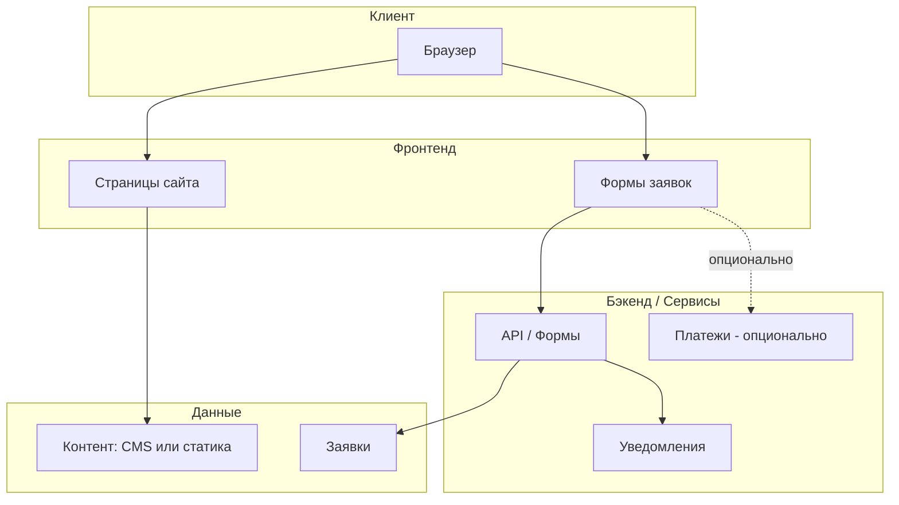

# AVATERRA — описание проекта

**Проект:** Веб-сайт школы AVATERRA (Phygital школа мышечного тестирования, курс «Тело не врет»)  
**Домен:** https://avaterra.pro  
**Версия документа:** 3.7.0 (совпадает с `package.json`)  
**Дата:** 2026-07-10

---

## 1. Цели проекта

| Цель | Описание |
|------|----------|
| **Основная** | Продажа курсов школы через сайт |
| **Информационная** | Предоставление информации о школе и услугах |
| **Конверсия** | Вовлечение посетителей и перевод в заявки/оплату курсов |

---

## 2. Функциональные требования

### 2.1 Структура сайта (концепция 2.0)

Ориентация на конверсию и современные тренды: основательница в центре, короткие блоки, один явный CTA.

| Секция | Содержание |
|--------|------------|
| **Hero** | Фото основательницы Татьяны Стрельцовой + название школы + ценность + один CTA «Записаться на консультацию» |
| **Почему AVATERRA** | 4 карточки ценностей + цифры (20 лет, 15 000+ человек) |
| **Форматы работы** | 4 карточки: консультация (5 000 ₽), групповой тренинг (3 000 ₽/чел.), курс AVATERRA 10 занятий (25 000 ₽), онлайн (3 500 ₽). Курс выделен как «Популярный». |
| **О мастере** | Второе фото Татьяны + краткая история от первого лица + CTA |
| **Отзывы** | 3 отзыва (сжатые формулировки) |
| **Записаться** | Контакты (имя, телефон, email, адрес) + форма заявки. Партнёры — одной строкой. |
| **Футер** | Логотип, слоган, кнопка «Записаться», копирайт |

Изображения: реальные фото Татьяны Стрельцовой в `public/images/tatiana/`; фоны hero и секции — сгенерированные в светлой кремовой палитре (hero-cream.jpg, section-cream.jpg). См. `docs/Content.md` и `docs/Media.md`.

### 2.2 Продажа курсов
- Карточки курсов с ясным CTA (записаться, купить, оставить заявку)
- Форма заявки и/или интеграция с платёжной системой
- Обработка заявок (уведомления, хранение)

### 2.3 Нефункциональные требования
- **Безопасность:** HTTPS; валидация ввода; cron-маршруты только с `CRON_SECRET` (`lib/cron-auth.ts`); rate limits на чувствительных API; CSP и security headers (`next.config.mjs`); на прод-VPS — ufw, sshd keys-only, Next.js bind 127.0.0.1, SCORM static через nginx `auth_request`. Подробнее — [Production-Server.md §6.2](Production-Server.md), [Diary.md — 2026-07-10](Diary.md).
- **Производительность:** быстрая загрузка, оптимизация изображений и ресурсов
- **Поддерживаемость:** понятная структура, документация, единый стиль кода
- **Консистентность:** единый тон, визуальный стиль, структура страниц

---

## 3. Архитектура

### 3.1 Общая схема


```mermaid
graph TB
    subgraph "Клиент"
        Browser[Браузер]
    end
    subgraph "Фронтенд"
        Pages[Страницы сайта]
        Forms[Формы заявок]
    end
    subgraph "Бэкенд / Сервисы"
        API[API / Формы]
        Payments[Платежи - опционально]
        Notify[Уведомления]
    end
    subgraph "Данные"
        CMS_or_Static[Контент: CMS или статика]
        Leads[Заявки]
    end
    Browser --> Pages
    Browser --> Forms
    Forms --> API
    API --> Leads
    API --> Notify
    Forms -.->|опционально| Payments
    Pages --> CMS_or_Static
```

### 3.2 Варианты технической реализации

| Вариант | Описание | Плюсы | Минусы |
|---------|----------|--------|--------|
| **A. Статический сайт + формы** | HTML/CSS/JS или SSG (e.g. Next.js, Astro), формы через внешний сервис (Formspree, Tilda и т.п.) | Простота, дешевый хостинг, безопасность | Ограниченная кастомизация сбора данных |
| **B. SSG + headless CMS** | Контент в CMS (Strapi, Sanity, etc.), сборка статики | Удобное редактирование контента без программиста | Сложнее и дороже в поддержке |
| **C. Full-stack приложение** | Фронт + свой бэкенд (Node, Python и т.д.) | Полный контроль, свои платежи, логика | Выше затраты на разработку и хостинг |

*Конкретный выбор зафиксировать после ответов на вопросы в `qa.md`.*

### 3.3 Структура проекта (текущая, v3.7.0)

**Стек:** Next.js 14 (App Router), TypeScript, Tailwind CSS, Framer Motion, React Three Fiber, PayKeeper, **Prisma + SQLite** (локально), NextAuth, Resend, Telegram Bot API (long-polling). Версионирование: SemVer, CHANGELOG.md.

**Локальная разработка:** Prisma + SQLite, без Docker. См. `docs/Local-Prisma.md`.

**Роли:** user (студент), manager (поддержка), admin. RBAC в middleware для `/portal/*`.

```
AVATERRA/
├── app/
│   ├── layout.tsx, page.tsx, globals.css
│   ├── (auth)/login, register, reset-password
│   ├── success/, oferta/, privacy/
│   ├── pay/[token]/                # Публичный чекаут персональных товаров
│   │   ├── page.tsx                # Форма оплаты с выбором рассрочки
│   │   ├── success/page.tsx        # Успешная оплата
│   │   └── fail/page.tsx           # Ошибка оплаты
│   ├── portal/                     # Портал (требует авторизации)
│   │   ├── layout.tsx              # Shell + PortalHeader
│   │   ├── student/                # ЛК студента
│   │   │   ├── dashboard, courses, certificates, media, notifications, profile
│   │   │   └── courses/[id]/play   # SCORM-плеер
│   │   ├── admin/                  # Консоль администратора
│   │   │   ├── dashboard, users, courses, certificates, media, payments, crm,
│   │   │   │   communications, ai-settings, audit, settings
│   │   │   ├── personal-products/  # Персональные товары (v3.6.0)
│   │   │   └── installments/       # Рассрочки (v3.6.0)
│   │   └── manager/                # Кабинет менеджера
│   │       └── dashboard, tickets, users, verifications
│   └── api/
│       ├── payment/create, webhook/paykeeper, contact, chat
│       ├── pay/[token]/            # API чекаута персональных товаров
│       │   ├── route.ts            # GET — данные товара
│       │   └── checkout/route.ts   # POST — создание заказа + PayKeeper
│       ├── cron/
│       │   └── installment-payments/ # Cron рассрочек (v3.6.0)
│       └── portal/
│           ├── admin/personal-products/ # CRUD персональных товаров
│           ├── admin/payment-links/     # PATCH/DELETE платёжных ссылок
│           ├── admin/installments/      # CRUD рассрочек
│           └── admin/services/          # CRUD товаров витрины
├── components/
│   ├── sections/   # Hero, About, Program, Author, Testimonials, Pricing, FAQ, Contact, Header, Footer
│   ├── portal/     # PortalHeader, PortalSidebar, UsersTable, PersonalProductAiHelper, CreateInstallmentDialog
│   ├── ui/, 3d/, PaymentModal.tsx, ChatBot.tsx
├── lib/
│   ├── utils.ts, paykeeper/, auth.ts, audit.ts, db.ts (export prisma)
│   ├── telegram.ts, telegram-fetch.ts, telegram-long-poll.ts, telegram-admin-notify.ts
│   ├── telegram-bot/              # router, faq, funnel, content-handlers, commands
│   ├── content/                   # SMM: planner, radar, quality-gates, publisher, jobs
│   ├── installment-notify.ts      # Уведомления по рассрочкам (v3.6.0)
│   ├── email-service.ts           # sendTransactionalEmail (context: module, entityId)
│   ├── certificates.tsx           # PDF сертификаты (@react-pdf/renderer)
├── prisma/
│   ├── schema.prisma              # Схема БД (52 миграции)
│   ├── seed.ts                    # Тестовые данные
├── scripts/
│   ├── telegram-poll-daemon.ts    # primary worker (systemd aletheia-telegram-poll.service)
│   ├── jobs-daemon.ts             # SMM scheduler (systemd aletheia-jobs.service)
│   ├── aletheia-telegram-poll.service, aletheia-jobs.service
│   ├── deploy-rsync-from-local.sh
├── middleware.ts                  # RBAC для /portal/*
├── CHANGELOG.md
├── docs/, .cursorrules, .env.example
└── README.md
```

---

## 4. Этапы разработки

| Этап | Содержание | Результат |
|------|------------|-----------|
| **1. Уточнение и дизайн** | Ответы на qa.md, согласование контента и прототипа | ТЗ, макеты/референсы |
| **2. Базовая вёрстка** | Главная, о школе, услуги, курсы (без бэкенда) | Статичные страницы |
| **3. Формы и заявки** | Формы обратной связи и записи на курсы, приём заявок | Работающие формы |
| **4. Интеграции** | Платежи, почта/уведомления (по решению) | Полный цикл заявки/оплаты |
| **5. Контент и SEO** | Тексты, техническое SEO/GEO, sitemap/robots/llms, вебмастеры — см. [SEO.md](SEO.md) | Индексация + цитируемость в поиске и ИИ |
| **6. Запуск и поддержка** | Деплой, мониторинг, правки | Продакшен и сопровождение |

---

## 5. Технологии и стандарты

### 5.1 Текущий стек
- **Фреймворк:** Next.js 14 (App Router), TypeScript
- **Стили:** Tailwind CSS (палитра: primary #2D1B4E, secondary #D4AF37, dark #0A0E27), шрифты Literata + Outfit
- **Анимации:** Framer Motion, React Three Fiber (Hero)
- **Платежи:** PayKeeper API (lib/paykeeper.ts)
- **Данные:** Prisma + SQLite (локально). Модели: User, Profile, Course, Enrollment, ScormProgress, Certificate, Media, Notification, Ticket, AuditLog, CommsTemplate, LlmSetting, Service, UserEnergy, Lead, Order.
- **Аутентификация:** NextAuth (Credentials provider), bcryptjs.
- **Портал:** Роли user/manager/admin, middleware RBAC, SCORM-плеер (iframe + API progress), сертификаты (PDF через @react-pdf/renderer), Resend для email, **Telegram Bot API** — на проде **long-polling** (один worker `aletheia-telegram-poll.service` → `scripts/telegram-poll-daemon.ts` → `lib/telegram-long-poll.ts` → `routeTelegramUpdate`; offset в `TELEGRAM_POLL_STATE_DIR`, по умолчанию `/var/lib/aletheia`; webhook не регистрируется, маршрут `/api/portal/telegram/webhook` — stub `{ mode: 'polling' }`), исходящие вызовы через `lib/telegram-fetch.ts` (`TELEGRAM_API_TIMEOUT_MS`, опционально `HTTPS_PROXY` при блокировке `api.telegram.org`), **оповещения админов** (`lib/telegram-admin-notify.ts`: заявки, регистрации, оплаты, тикеты, ошибки PayKeeper; Chat ID — `telegram_admin_chat_ids` в Портал → Настройки → Интеграции).
- **AI и чаты:** публичный чат на лендинге (`/api/chat`, база знаний и шаблоны промптов `scope=chatbot`); AI-тьютор в плеере (`/api/portal/scorm/ai-assist`, `LlmSetting` / шаблон `course-tutor`); рендер ответов через `ChatMarkdown` + linkify для кликабельных URL; справка в портале (`HelpContent`, якоря `#ai-tutor`, `#ai-tutor-admin`, прокрутка по hash); палитра команд ⌘K (`lib/portal-nav-commands.ts`).
- **Хранилище:** локальные файлы в `public/uploads/` (SCORM, медиа).
- **Деплой:** Vercel или VPS — общий чек-лист [Deploy.md](Deploy.md), продуктивный сервер и порядок обновления [Production-Server.md](Production-Server.md)

### 5.2 Стандарты кода и процесса
- **Консистентность:** единый стиль именования (файлы, классы, переменные)
- **Доступность:** базовая a11y (семантика, контраст, фокус)
- **Безопасность:** валидация и санитизация ввода, HTTPS, не хранить чувствительные данные в клиенте; обязательный `CRON_SECRET`; маскировка секретов в admin API; prod bind 127.0.0.1 — см. CHANGELOG [3.7.0] Security (2026-07-10)
- **Документирование:** обновление Project.md при изменении архитектуры или функциональных требований

### 5.3 Поддерживаемость
- Чёткое разделение: разметка / стили / логика
- Переиспользуемые компоненты/блоки
- Документация решений в Diary.md

---

## 6. Связанные документы

| Документ | Назначение |
|----------|------------|
| `docs/Project.md` | Этот файл — цели, архитектура, этапы, технологии |
| `docs/Content.md` | Все тексты с прототипа для вёрстки и наполнения |
| `docs/Media.md` | Изображения: Татьяна с прототипа, остальные — в едином стиле |
| `docs/Local-Prisma.md` | Локальный запуск (Prisma + SQLite) |
| `docs/Tasktracker.md` | Отслеживание задач и приоритетов |
| `docs/Diary.md` | Дневник решений, наблюдений и проблем |
| `docs/qa.md` | Вопросы по архитектуре и требованиям |
| `docs/Production-Server.md` | Продуктивный VPS: `/opt/ALETHEIA`, systemd, расширенная диагностика `scripts/prod-diagnostics.sh` |
| `docs/Server-Setup.md` | **Legacy:** сценарий `/var/www` + PM2 — не смешивать с текущим продом avaterra.pro |

---

*При внесении изменений в архитектуру или добавлении новых функциональных требований — обновлять данный файл и при необходимости Tasktracker.md и Diary.md.*
